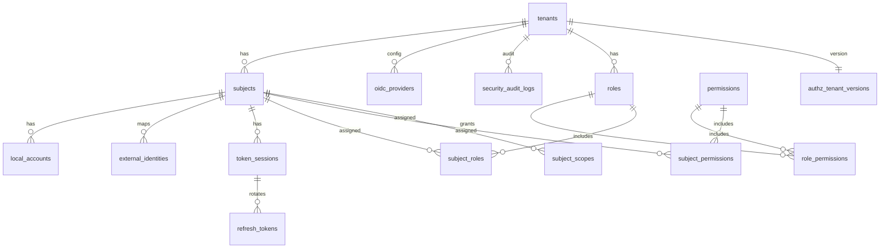

# Security 資料模型規劃（落地版）

> 目標：支援多租戶（Shared DB + Shared Schema）的驗證/授權資料模型，並以資料庫約束保證 tenant 隔離與 identity mapping 規則。

重要邊界：
- Access token (JWT) **不入庫**。
- Refresh token **只存 hash**（不可存原文）。
- Security Audit Log **必入庫、append-only**。
- Application/Error log **只寫 JSON 檔案**（Birdsoft.Infrastructure.Logging.Json），**不入 DB**。

## 0. ERD（Mermaid）

> 註：audit log 實際表名為 `security_audit_logs`（append-only）。

## 1. 主要表

### Tenants
- `tenant_id` (PK, GUID)
- `name`
- `status`（Active/Suspended/Archived）
- `token_version`（tenant 強制重新登入用）
- `created_at`
- `updated_at`

索引/唯一：
- PK `(tenant_id)`

### Subjects
- `(tenant_id, our_subject)` (PK composite)
- `display_name`（nullable）
- `status`（Active/Disabled/Locked）
- `token_version`（subject 強制重新登入用）
- `created_at`
- `updated_at`

索引/唯一：
- PK `(tenant_id, our_subject)`
- INDEX `(tenant_id, status)`
- INDEX `(tenant_id, updated_at)`

### LocalAccounts（= subject_credentials；tenant-scoped）

> 功能可由 feature flag 關閉，但 schema 先建。

- `id` (PK)
- `tenant_id`
- `our_subject`
- `username_or_email`
- `password_hash`
- `hash_version`
- `last_password_change_at`
- `failed_access_count`
- `locked_until`
- `created_at`
- `updated_at`

索引/唯一：
- UNIQUE `(tenant_id, username_or_email)`
- UNIQUE `(tenant_id, our_subject)`
- INDEX `(tenant_id, locked_until)`

### ExternalIdentities（OIDC/OAuth mapping）
- `id` (PK)
- `tenant_id`
- `our_subject`
- `provider`（line/ms/google…）
- `issuer`
- `provider_sub`
- `enabled`（bool）
- `disabled_at`（nullable）
- `disabled_reason`（nullable）
- `created_at`

索引/唯一（關鍵）：
- UNIQUE `(tenant_id, provider, issuer, provider_sub)`
- INDEX `(tenant_id, our_subject)`
- INDEX `(tenant_id, provider)`

> 注意：同一個 subject 允許綁多個外部 provider（Google + Microsoft + LINE），因此 **不能**對 `(tenant_id, our_subject)` 做 UNIQUE。

### OidcProviderSettings（全域 provider 設定）

需求已確認：每個 provider 使用同一組 clientId（不因 tenant 而異），但 tenant 可停用 provider。

- `provider` (PK)（line/ms/google…）
- `client_id`
- `client_secret`
- `issuer`（如 OIDC issuer）
- `authorization_endpoint` / `token_endpoint` / `userinfo_endpoint`（視採用的 library 決定是否需要自存）
- `enabled`（全域開關）

### TenantEnabledProviders（逐租戶啟用 provider）

- `(tenant_id, provider)` (PK)
- `enabled`（可選；若 PK 存在即代表啟用，也可用欄位軟停用）

索引/唯一：
- PK `(tenant_id, provider)`

### AuthStates（一次性 state）
- `state` (PK)
- `tenant_id`
- `created_at`
- `expires_at`（now+5m）
- `used_at`（null 代表未使用）
- `provider`（nullable；attach 後不可再變更）
- `code_verifier`（PKCE；nullable；attach 後不可再變更）
- `nonce`（nullable；attach 後不可再變更）

索引：
- INDEX `(expires_at)`

### RefreshTokens（只存 hash）
- `id` (PK)
- `tenant_id`
- `our_subject`
- `session_id`（綁定 access token 的 session）
- `token_hash`
- `created_at`
- `expires_at`
- `revoked_at`（null 代表有效）
- `replaced_by_refresh_token_id`（rotation）
- `issued_tenant_tv` / `issued_subject_tv`（簽發當下版本，用於 refresh 驗證）

索引：
- UNIQUE `(token_hash)`
- INDEX `(tenant_id, session_id)`
- INDEX `(tenant_id, our_subject, revoked_at, expires_at)`

規則：
- Refresh rotation：用 `replaced_by_refresh_token_id` 串起來；舊 token 會被 revoke（不覆寫/不存原文）。

### TokenSessions（可撤銷 session）

- `(tenant_id, session_id)` (PK composite)
- `our_subject`
- `created_at`
- `terminated_at`（nullable）
- `termination_reason`（nullable）
- `client_id`（nullable）
- `device_id`（nullable）
- `ip`（nullable）
- `user_agent`（nullable）

索引：
- INDEX `(tenant_id, our_subject)`
- INDEX `(terminated_at)`

### AuthEvents（稽核事件）

- `id` (PK)
- `occurred_at`
- `tenant_id`（nullable）
- `our_subject`（nullable）
- `session_id`（nullable）
- `type`（int enum）
- `outcome`（string）
- `detail`（nullable string）

索引：
- INDEX `(occurred_at)`
- INDEX `(tenant_id)`
- INDEX `(tenant_id, occurred_at)`
- INDEX `(tenant_id, code, occurred_at)`
- INDEX `(tenant_id, our_subject, occurred_at)`
- INDEX `(session_id)`
- INDEX `(type)`

規則：
- 僅允許 INSERT（append-only）；Repository/Store 層禁止 Update/Delete。
- Retention 可配置，由背景 job 以 `occurred_at` 清理（例如保留 90/180/365 天）。

## 2. 授權（Role/Permission）

落地採用：Role-based + Direct permissions + Scopes

### 2.1 Entitlements（Products / TenantProducts）

> 用途：將 permission 按 product 分組，並以 tenant 是否啟用 product 作為強制門禁。

### Products（全域表）
- `product_id` (PK, GUID)
- `product_key`（UNIQUE；例如 `orders`）
- `display_name`
- `description`（nullable）
- `status`（Active/Disabled）
- `created_at`
- `updated_at`

索引/唯一：
- UNIQUE `(product_key)`
- INDEX `(status)`

### TenantProducts（逐租戶 entitlement；有效期間 + 狀態）
- PK `(tenant_id, product_key)`
- `status`（Enabled/Disabled）
- `start_at`（開始時間）
- `end_at`（nullable；若為 null 表示無結束）
- `plan_json`（nullable；預留方案/配額）
- `created_at`
- `updated_at`

索引：
- INDEX `(tenant_id, status)`
- INDEX `(product_key, status)`
- INDEX `(tenant_id, product_key, status)`
- INDEX `(tenant_id, end_at)`

有效性（概念規則）：
- 產品在某 tenant 下被視為啟用需同時滿足：
	- `tenant_products.status == Enabled`
	- `products.status == Active`
	- `start_at <= now` 且（`end_at is null` 或 `now < end_at`）

### Roles
- PK `(tenant_id, role_id)`
- UNIQUE `(tenant_id, role_name)`

### Permissions（全域表）
- PK `(perm_id)`
- UNIQUE `(perm_key)`（例如 `orders.read` 或 `orders:read`）

補充欄位（落地實作已存在）：
- `product_key`（nullable；用於將 permission 對應到某個產品，以供 entitlement 門禁）

索引：
- INDEX `(product_key)`

### RolePermissions
- PK `(tenant_id, role_id, perm_id)`
- FK `(tenant_id, role_id)` -> roles
- FK `(perm_id)` -> permissions
- INDEX `(tenant_id, perm_id)`

### SubjectRoles
- PK `(tenant_id, our_subject, role_id)`
- FK `(tenant_id, our_subject)` -> subjects
- FK `(tenant_id, role_id)` -> roles
- INDEX `(tenant_id, role_id)`

### SubjectPermissions
- PK `(tenant_id, our_subject, perm_id)`
- FK `(tenant_id, our_subject)` -> subjects
- FK `(perm_id)` -> permissions
- INDEX `(tenant_id, perm_id)`

### SubjectScopes
- PK `(tenant_id, our_subject, scope_key)`
- FK `(tenant_id, our_subject)` -> subjects
- INDEX `(tenant_id, scope_key)`

### AuthzTenantVersions
- PK `(tenant_id)`
- `model_version`（long）
- `updated_at`

> 此版本用於治理/快取失效，不直接影響 JWT 的有效性（JWT 即時失效仍由 tenant/subject 的 token_version 驅動）。

## 3. 交易一致性建議

- OIDC callback 首次登入：建立 Subject + ExternalIdentity 必須在同一交易，避免重複建立。
- Refresh rotation：寫入新 refresh、撤銷舊 refresh 必須同交易。

## 4. 敏感資料最小化/禁止寫入規範（必遵守）

任何 log（包含 `security_audit_logs.MetaJson` / `Detail`）禁止包含：
- `password` / `password_hash`
- `access_token` / `refresh_token` / `id_token` 原文
- refresh token hash（避免可被拿來 offline 攻擊或關聯）
- 完整 PII（email/phone 若有需求僅允許 mask 或 hash，且需產品規範）

例外與 stack trace：
- 只允許寫入 JSON file log（Birdsoft.Infrastructure.Logging.Json），不得入庫。

## 5. 查詢規範（tenant_id 必為前置條件）

- 所有讀寫必須先 tenant scope（`WHERE tenant_id = @tenantId`），避免 cross-tenant data leak。
- RBAC 常用查詢：
	- subject -> roles：走 `subject_roles (tenant_id, our_subject)`
	- roles -> permissions：走 `role_permissions (tenant_id, role_id)` + `permissions (perm_id)`
	- subject -> permissions：`subject_permissions` UNION (role-derived)

## 6. Migration / 版本演進策略（摘要）

目前專案以 `EnsureCreated()` 建 schema（dev/test）。若要正式上線，建議：
- 導入 EF Core Migrations（SQLite/PostgreSQL 皆可），以「新增欄位/新增表」方式演進。
- MFA/policy/resource-level authorization：
	- 優先新增獨立表（例如 `mfa_factors`, `policies`, `policy_bindings`, `resource_permissions`）
	- 避免修改既有 PK；以新增 UNIQUE/INDEX + 新欄位取代破壞性變更。

