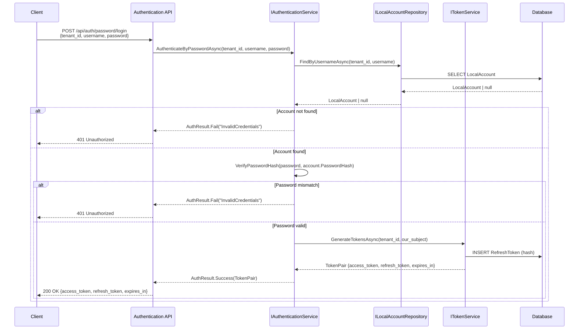
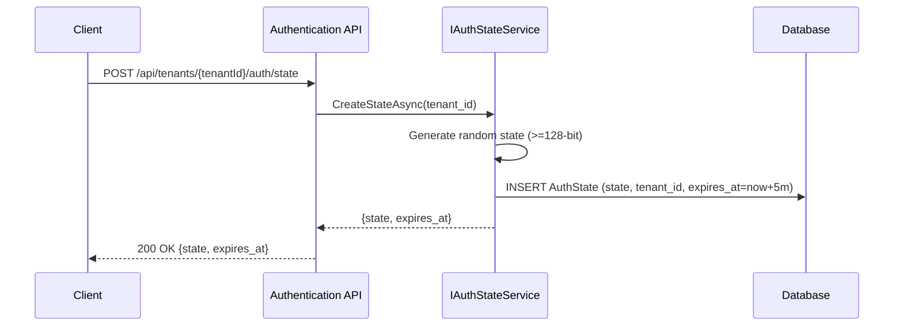
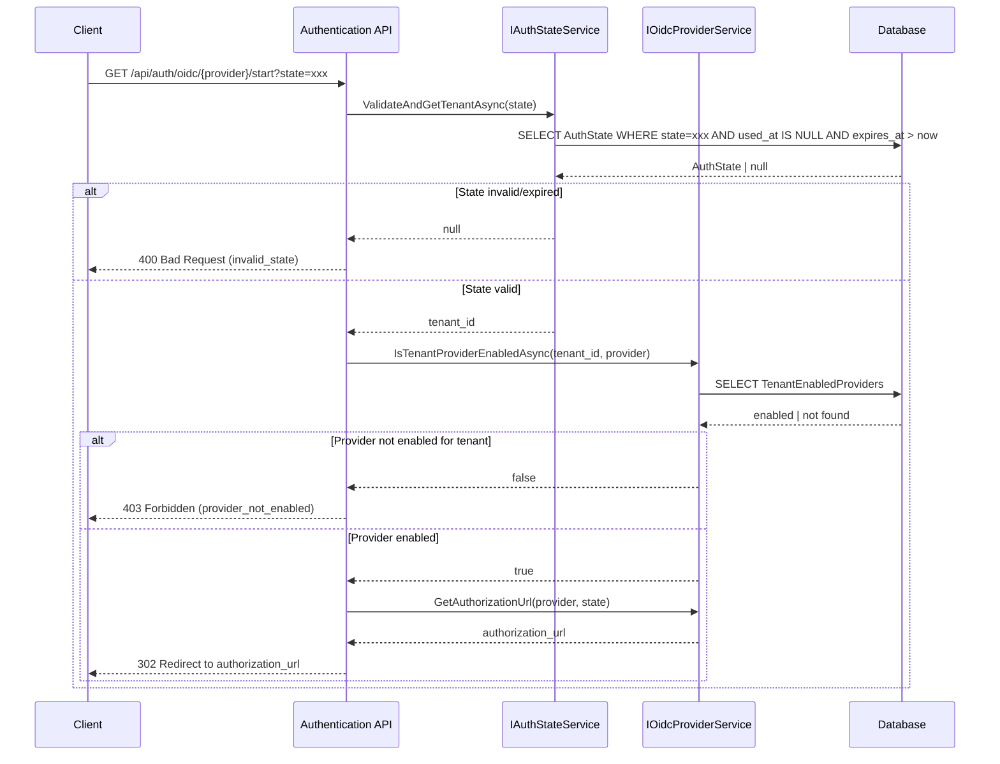
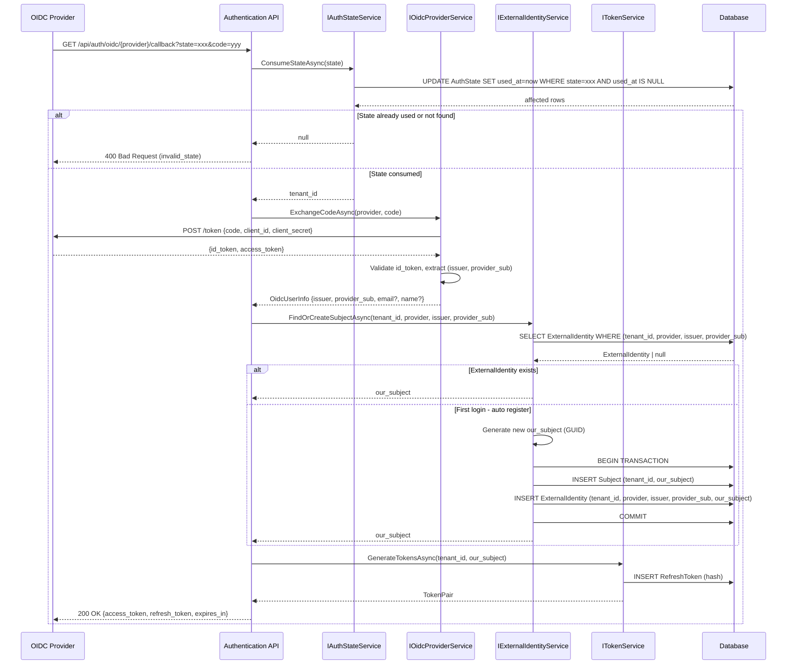
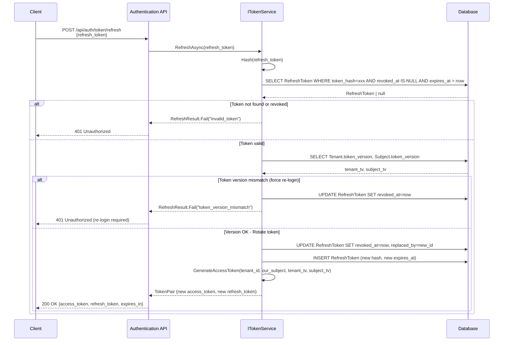
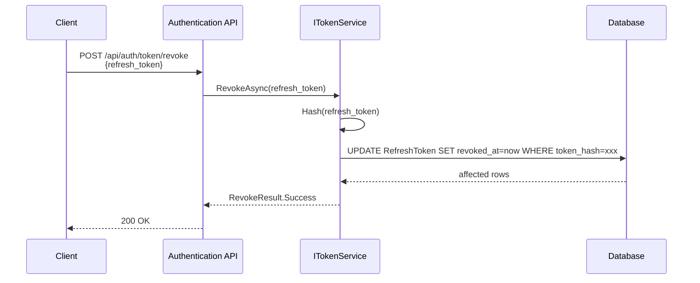
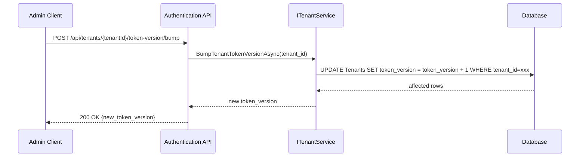
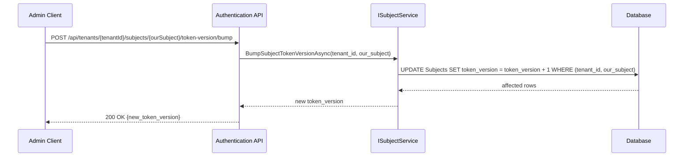
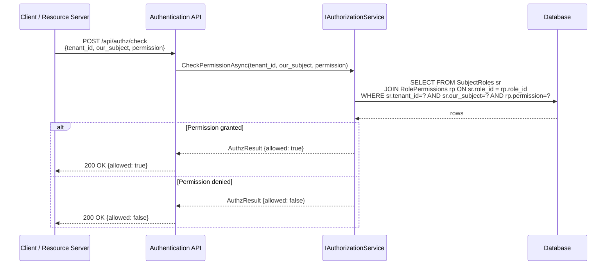
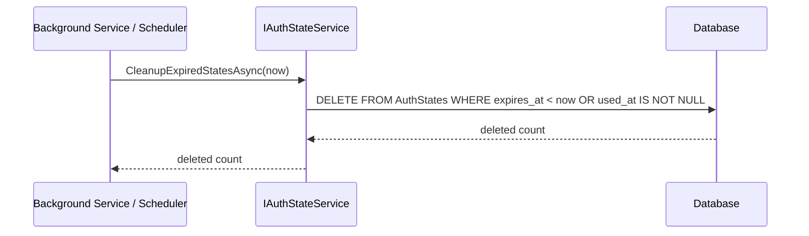

# Company.Security 循序圖

> 以 Mermaid 格式繪製主要驗證/授權流程。

---

## 1. Password Login（自家帳密登入）

---

## 2. OIDC Login（外部登入 - 含 State 建立與 Callback）

### 2.1 建立 State

### 2.2 啟動 OIDC Challenge

### 2.3 OIDC Callback（首次登入自動註冊）

---

## 3. Token Refresh

---

## 4. Token Revoke

---

## 5. Force Re-login（Bump Token Version）

### 5.1 Tenant 級別

### 5.2 Subject 級別

---

## 6. Authorization Check

---

## 7. Cleanup Expired States

