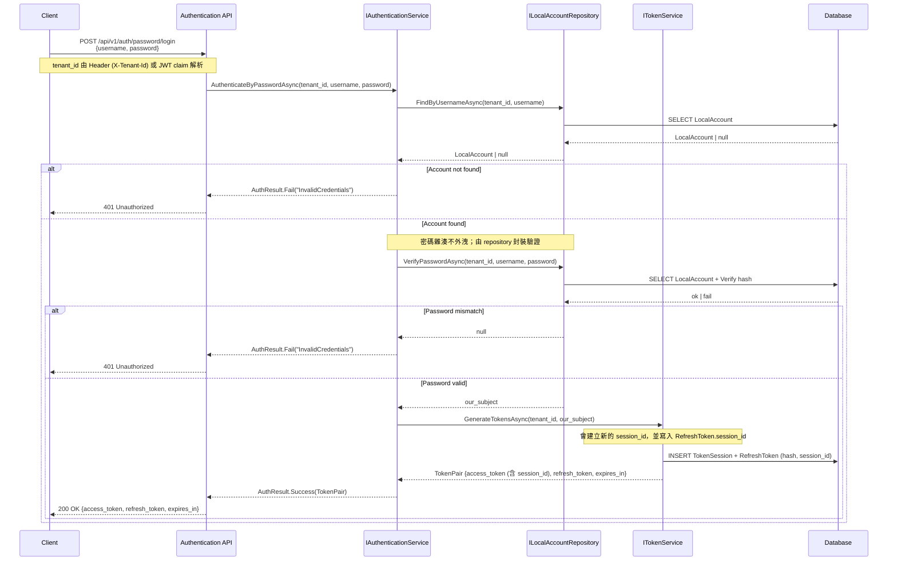
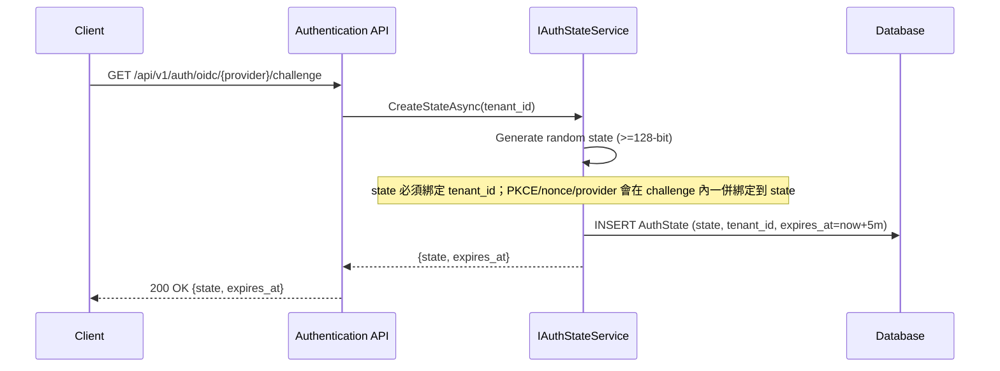
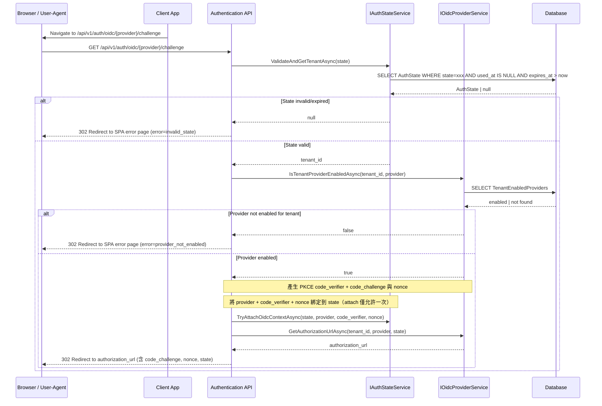
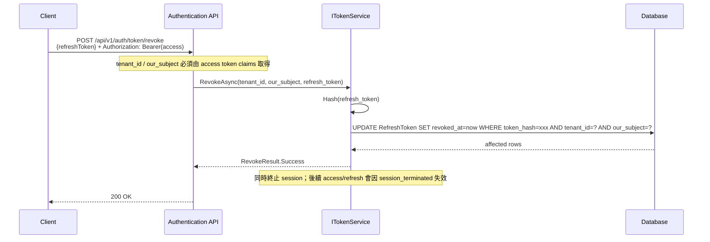
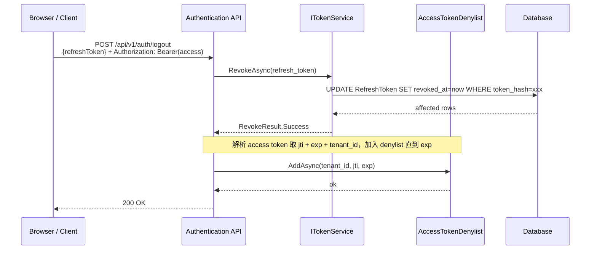
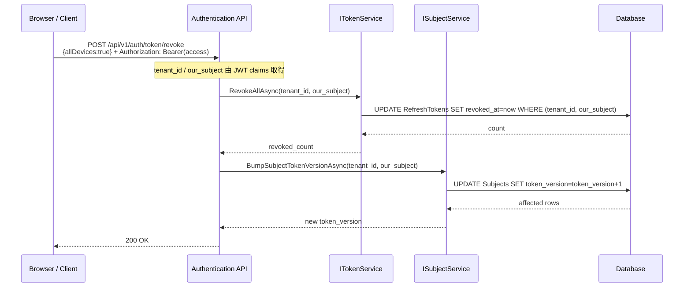
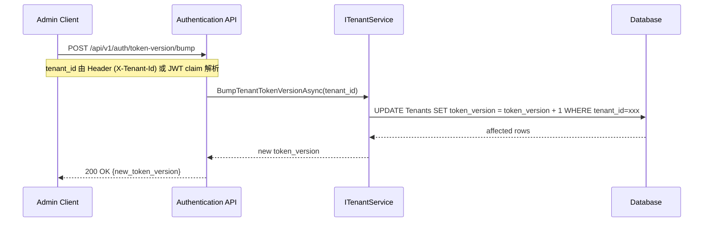
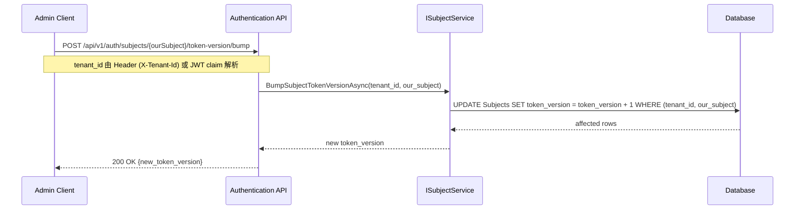
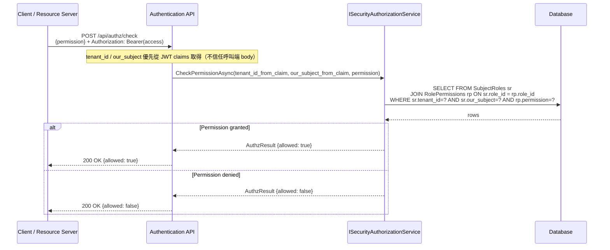
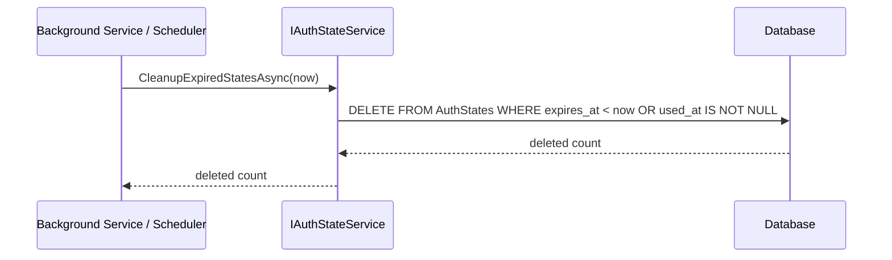

# Security 循序圖

> 以 Mermaid 格式繪製主要驗證/授權流程。

---

## 1. Password Login（自家帳密登入）



---

## 2. OIDC Login（外部登入 - 含 PKCE / nonce / State 與 Callback）

### 2.1 建立 State（一次性，5 分鐘）



### 2.2 啟動 OIDC Challenge（PKCE + nonce）



### 2.3 OIDC Callback（首次登入自動註冊；回應給 Browser/Client）

```mermaid
sequenceDiagram
    participant B as Browser / User-Agent
    participant SPA as Client App
    participant P as OIDC Provider
    participant API as Authentication API
    participant SS as IAuthStateService
    participant PS as IOidcProviderService
    participant ES as IExternalIdentityService
    participant TS as ITokenService
    participant DB as Database

    P->>B: Redirect back with code + state
    B->>API: GET /api/v1/auth/oidc/{provider}/callback?state=xxx&code=yyy
    API->>SS: ConsumeStateAsync(state)
    SS->>DB: UPDATE AuthState SET used_at=now WHERE state=xxx AND used_at IS NULL
    DB-->>SS: affected rows

    alt State already used or not found
        SS-->>API: null
        API-->>B: 302 Redirect to SPA error page (error=invalid_state)
    else State consumed
        SS-->>API: AuthStateContext {tenant_id, provider, code_verifier, nonce, ...}
        note over API: callback 會先 consume state（一次性）再做後續驗證；任何失敗都不允許重用同一 state
        alt Optional: X-Tenant-Id header present but mismatch
            API-->>B: 400 ApiResponse.Fail("invalid_state")
        else Provider mismatch
            API-->>B: 400 ApiResponse.Fail("invalid_state")
        else Continue
        note over API,PS: 交換 code 時需帶入 PKCE code_verifier；並在驗證 id_token 時驗 nonce
        API->>PS: ExchangeCodeAsync(tenant_id, provider, code, ctx)
        PS->>P: POST /token {code, client_id, client_secret, code_verifier(from state context)}
        P-->>PS: {id_token, access_token}
        PS->>PS: Validate id_token (含 nonce), extract (issuer, provider_sub)
        alt Nonce mismatch
            API-->>B: 400 ApiResponse.Fail("invalid_nonce")
        else PKCE mismatch
            API-->>B: 400 ApiResponse.Fail("invalid_pkce")
        else OK
        PS-->>API: OidcUserInfo {issuer, provider_sub, email?, name?}

        API->>ES: FindOrCreateSubjectAsync(tenant_id, provider, issuer, provider_sub)
        ES->>DB: SELECT ExternalIdentity WHERE (tenant_id, provider, issuer, provider_sub)
        DB-->>ES: ExternalIdentity | null

        alt ExternalIdentity exists
            ES-->>API: our_subject
        else First login - auto register
            ES->>ES: Generate new our_subject (GUID)
            ES->>DB: BEGIN TRANSACTION
            ES->>DB: INSERT Subject (tenant_id, our_subject)
            ES->>DB: INSERT ExternalIdentity (tenant_id, provider, issuer, provider_sub, our_subject)
            ES->>DB: COMMIT
            ES-->>API: our_subject
        end

        API->>TS: GenerateTokensAsync(tenant_id, our_subject)
        TS->>DB: INSERT TokenSession + RefreshToken (hash, session_id)
        TS-->>API: TokenPair
        note over API,B: 實務上 callback 通常以 redirect 回前端（或寫入 HttpOnly cookie）
        API-->>B: 302 Redirect to SPA callback (攜帶 tokens 或 session cookie)
        B-->>SPA: Load callback page / complete login
        end
    end
```

---

## 3. Token Refresh

```mermaid
sequenceDiagram
    participant C as Client
    participant API as Authentication API
    participant TS as ITokenService
    participant DB as Database

    C->>API: POST /api/auth/token/refresh<br/>{refresh_token}
    API->>TS: RefreshAsync(refresh_token)
    TS->>TS: Hash(refresh_token)
    TS->>DB: SELECT RefreshToken WHERE token_hash=xxx
    DB-->>TS: RefreshToken | null

    alt Token not found
        TS-->>API: RefreshResult.Fail("invalid_token")
        API-->>C: 401 Unauthorized (invalid_token)
    else Token found
        alt Token expired (not revoked)
            TS-->>API: RefreshResult.Fail("expired_token")
            API-->>C: 401 Unauthorized (expired_token; re-login required)
        else Token revoked
            alt revoked due to rotation (replaced_by != null)
                note over TS,DB: refresh token reuse 偵測：rotation 後舊 token 再次被使用，視為可能被竊
                TS->>DB: REVOKE ALL RefreshTokens for (tenant_id, our_subject)
                TS->>DB: INCREMENT Subject.token_version (force re-login)
                TS-->>API: RefreshResult.Fail("refresh_token_reuse_detected")
                API-->>C: 401 Unauthorized (re-login required)
            else revoked by user logout
                TS-->>API: RefreshResult.Fail("revoked_token")
                API-->>C: 401 Unauthorized (revoked_token)
            end
        else Token valid (not revoked & not expired)
        TS->>DB: SELECT Tenant.token_version, Subject.token_version
        DB-->>TS: tenant_tv, subject_tv

        alt Token version mismatch (force re-login)
            TS->>DB: UPDATE RefreshToken SET revoked_at=now
            TS-->>API: RefreshResult.Fail("token_version_mismatch")
            API-->>C: 401 Unauthorized (re-login required)
        else Version OK - Rotate token (atomic)
            note over TS,DB: rotation 必須同交易，避免併發 refresh 造成雙花（double-mint）
            TS->>DB: BEGIN TRANSACTION
            TS->>DB: INSERT RefreshToken (new_id, new hash, expires_at)
            TS->>DB: UPDATE RefreshToken SET revoked_at=now, replaced_by=new_id WHERE revoked_at IS NULL
            alt update affected = 0 (lost race)
                TS->>DB: ROLLBACK
                TS-->>API: RefreshResult.Fail("revoked_refresh_token")
                API-->>C: 401 Unauthorized (revoked_refresh_token)
            else update affected = 1
                TS->>DB: COMMIT
            TS->>TS: GenerateAccessToken(tenant_id, our_subject, tenant_tv, subject_tv)
            TS-->>API: TokenPair {new access_token, new refresh_token}
            API-->>C: 200 OK {access_token, refresh_token, expires_in}
            end
        end
    end
```

---

## 4. Token Revoke



---

## 4.1 Logout（Legacy alias）

> `/api/v1/auth/logout` 為 legacy alias；建議改用 `/api/v1/auth/token/revoke`。

> 若要「Access Token 在有效期內仍可立即失效」，需導入 denylist（以 jti 為鍵）並在每次 API 驗證 JWT 時查核。



---

## 4.2 Revoke All Devices（全裝置登出）



---

## 5. Force Re-login（Bump Token Version）

### 5.1 Tenant 級別



### 5.2 Subject 級別



---

## 6. Authorization Check



---

## 7. Cleanup Expired States


