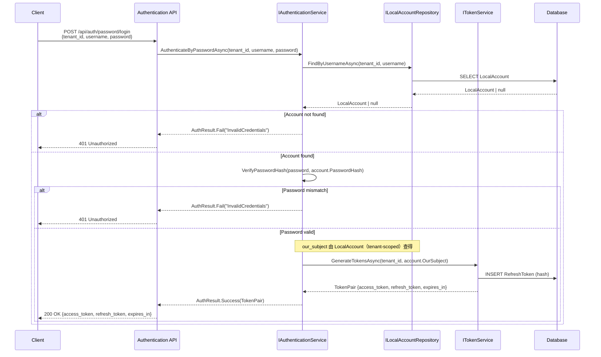
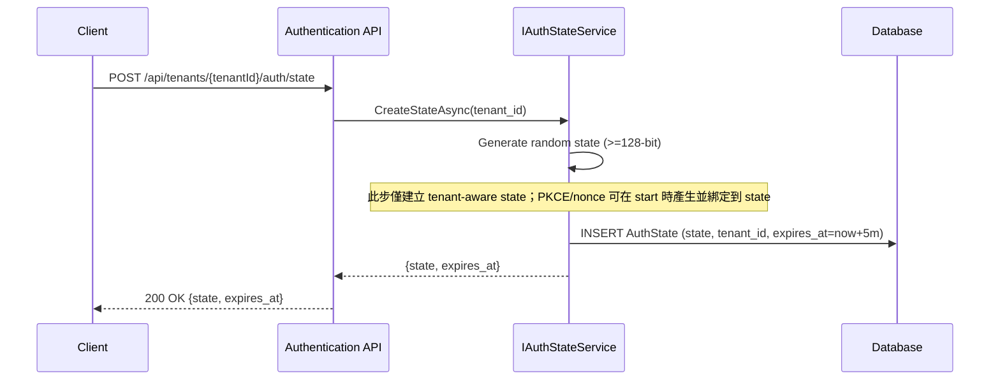
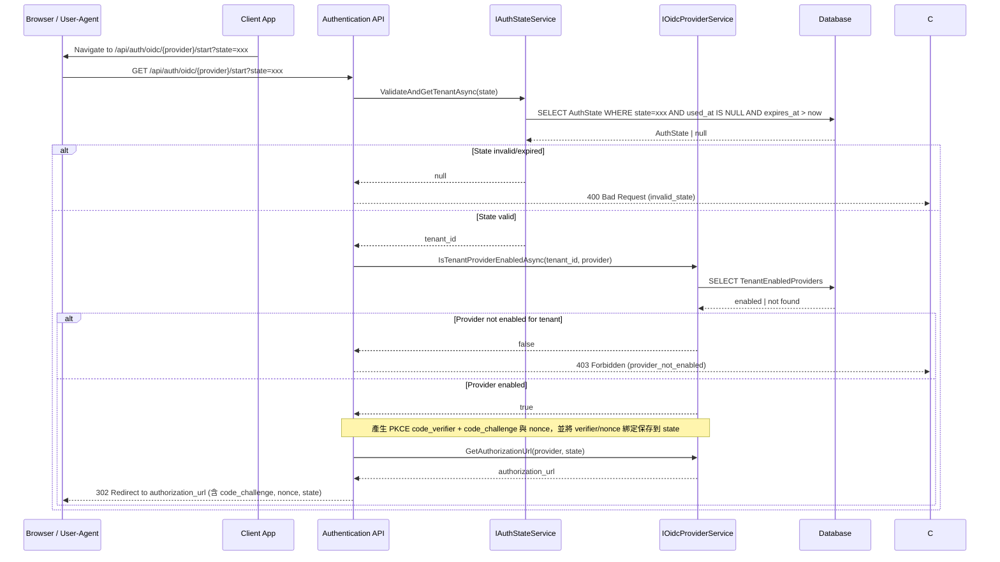
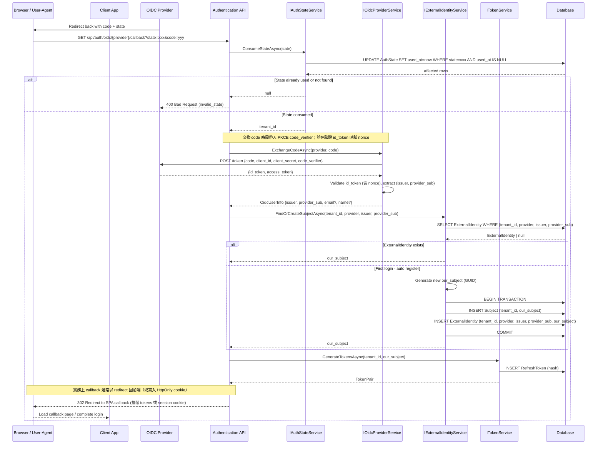
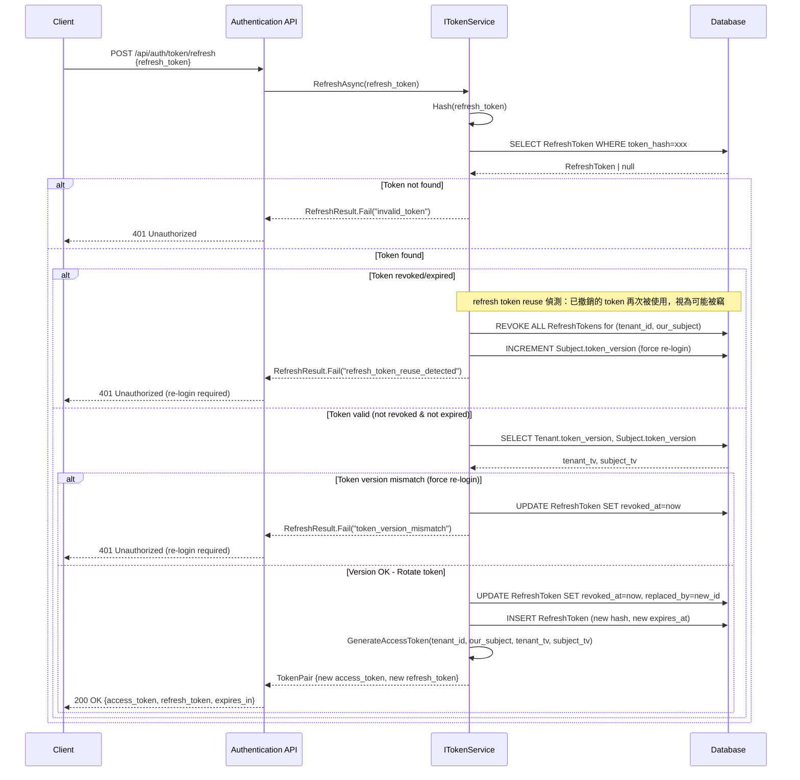
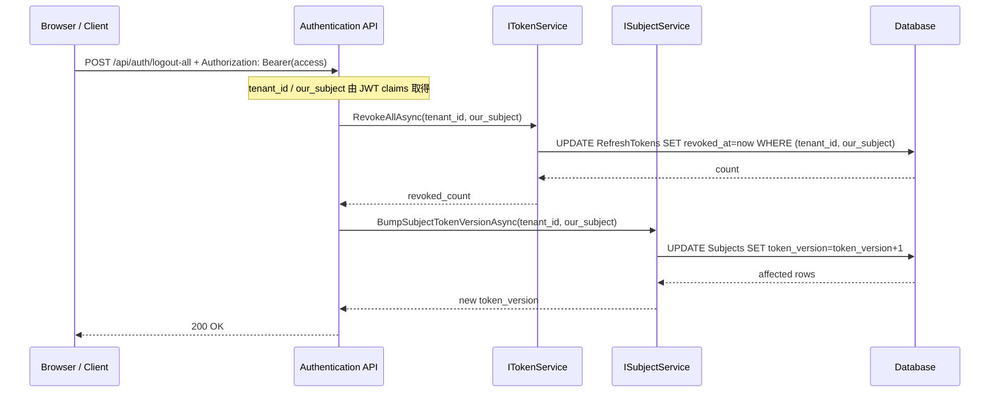
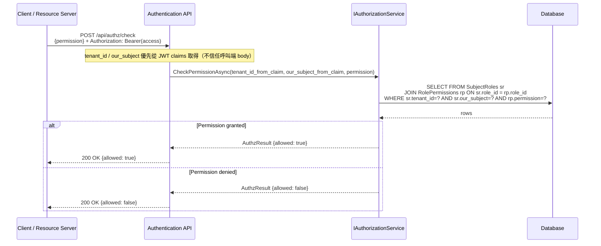

# Company.Security 循序圖

> 以 Mermaid 格式繪製主要驗證/授權流程。

---

## 1. Password Login（自家帳密登入）



---

## 2. OIDC Login（外部登入 - 含 PKCE / nonce / State 與 Callback）

### 2.1 建立 State（一次性，5 分鐘）



### 2.2 啟動 OIDC Challenge（PKCE + nonce）



### 2.3 OIDC Callback（首次登入自動註冊；回應給 Browser/Client）



---

## 3. Token Refresh



---

## 4. Token Revoke

```mermaid
sequenceDiagram
    participant C as Client
    participant API as Authentication API
    participant TS as ITokenService
    participant DB as Database

    C->>API: POST /api/auth/token/revoke<br/>{refresh_token}
    API->>TS: RevokeAsync(refresh_token)
    TS->>TS: Hash(refresh_token)
    TS->>DB: UPDATE RefreshToken SET revoked_at=now WHERE token_hash=xxx
    DB-->>TS: affected rows
    TS-->>API: RevokeResult.Success
    API-->>C: 200 OK

---

## 4.1 Logout（單裝置登出，建議同時撤銷 Access Token）

> 若要「Access Token 在有效期內仍可立即失效」，需導入 denylist（以 jti 為鍵）並在每次 API 驗證 JWT 時查核。

```mermaid
sequenceDiagram
    participant B as Browser / Client
    participant API as Authentication API
    participant TS as ITokenService
    participant DL as AccessTokenDenylist
    participant DB as Database

    B->>API: POST /api/auth/logout<br/>{refresh_token} + Authorization: Bearer(access)
    API->>TS: RevokeAsync(refresh_token)
    TS->>DB: UPDATE RefreshToken SET revoked_at=now WHERE token_hash=xxx
    DB-->>TS: affected rows
    TS-->>API: RevokeResult.Success

    note over API,DL: 解析 access token 取 jti + exp + tenant_id，加入 denylist 直到 exp
    API->>DL: AddAsync(tenant_id, jti, exp)
    DL-->>API: ok

    API-->>B: 200 OK
```

---

## 4.2 Logout All Devices（全裝置登出）


```

---

## 5. Force Re-login（Bump Token Version）

### 5.1 Tenant 級別


### 5.2 Subject 級別


---

## 6. Authorization Check



---

## 7. Cleanup Expired States


